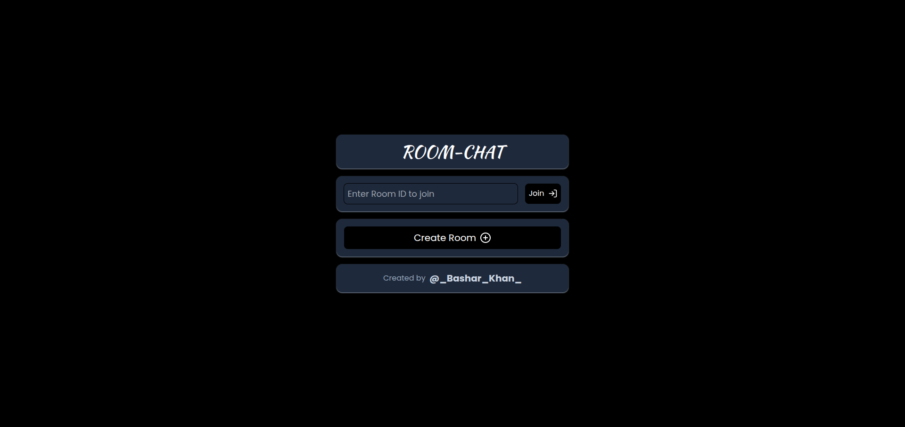
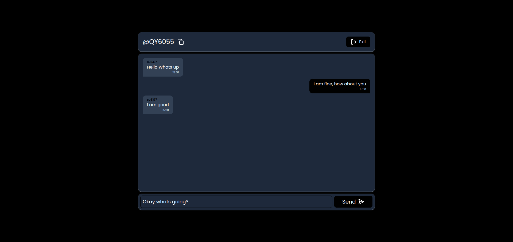

**Room-Chat-App README.md**
=====================================

**Overview**
------------

Room-Chat-App is a simple chat application that allows users to create and join chat rooms, and send messages to other users in the same room.

**Screenshots**
--------------

* **Join Room Screen**
  
* **Chat Room Screen**
  


**Installation Guide**
---------------------

### Prerequisites

* Node.js (version 14 or higher)
* npm (version 6 or higher)

### Steps to Install

1. Clone the repository using the following command:
   ```bash
    git clone https://github.com/Basharkhan7776/Room-Chat-App.git
    ```
2. Navigate to the frontend of project directory:
    ```bash
    cd room-chat-app/client
    ```
3. Install the dependencies of frontend using npm:

   ```bash
    npm install
    ```
4. Start the frontend using npm:

   ```bash
    npm start
    ```
5. Navigate to the backend of the project directory:

   ```bash
    cd ../server
    ```
6. Install the dependencies of frontend using npm:

   ```bash
    npm install
    ```
7. Start the backend using npm:

   ```bash
    npm start
    ```
8. Now visit to `http://localhost:3000` in your browser to access the chat room.


**Features**
------------

* **Create Room**: Create a new chat room with a unique room name.
* **Join Room**: Join an existing chat room by entering the room name.
* **Send Messages**: Send messages to other users in the same room.
* **Real-time Messaging**: Receive messages from other users in real-time.

**Technical Details**
--------------------

* **Frontend**:
	+ Built using React and TypeScript for a robust and maintainable UI.
	+ Utilizes WebSockets for real-time communication with the backend.
* **Backend**:
	+ Built using Node.js and TypeScript for a scalable and efficient server.
	+ Utilizes WebSockets for real-time communication with the frontend.

**Contributing**
--------------

Contributions are welcome! If you'd like to contribute to the Room-Chat-App, please fork the repository and submit a pull request.

**License**
----------

The Room-Chat-App is licensed under the MIT License.